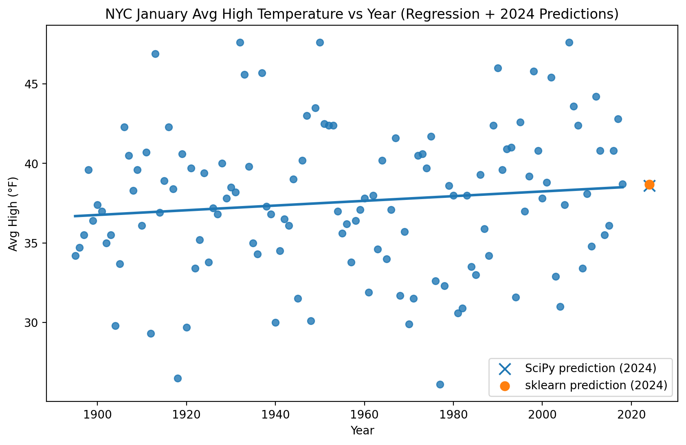

# datafun-07-ml

[](https://github.com/gracetulsi/datafun-07-ml/actions/workflows/deploy-mkdocs.yml)
[](https://github.com/gracetulsi/datafun-07-ml/actions/workflows/ci-basic-mkdocs.yml)
[](https://gracetulsi.github.io/datafun-07-ml/)
[](https://www.python.org/)

> Professional Python project: time series analysis, simple linear regression, and predictive analytics with Jupyter notebooks.

## Overview

This project explores introductory machine learning concepts including time series data, simple linear regression, and predictive analytics using Python, Jupyter notebooks, pandas, and scikit-learn.

**Author:** [Grace Tulsi](https://github.com/gracetulsi)

**Date:** February 2026

## Dataset

- **NYC January Average High Temperatures (1895–2018):** Historical time series data from NOAA used in textbook example 10.16 for simple linear regression. Located in `data/raw/ave_hi_nyc_jan_1895-2018.csv`.

## Module 7 Project

**Project deliverable notebook:** `notebooks/gracetulsi_ml.ipynb`

This notebook contains:
- **Part 1:** Chart a straight line (Fahrenheit → Celsius)
- **Part 2:** NYC January temperature prediction using SciPy `linregress`
- **Part 3:** NYC January temperature prediction using scikit-learn `LinearRegression` with train/test split
- **Part 4:** Insights comparing SciPy vs scikit-learn and why predictions may differ

## Project Highlight (Chart + Final Observations)



**Final observations:**
- The NYC January average high temperatures show a gradual long-term trend that can be approximated with a simple linear model.
- SciPy (`linregress`) and scikit-learn (`LinearRegression`) produce similar 2024 predictions; small differences are expected because the scikit-learn model uses a train/test split.
- This model uses only one feature (year), so it’s best interpreted as a baseline trend model rather than a high-accuracy forecast.

## Initial Setup

Following the [pro-analytics-02](https://gracetulsi.github.io/pro-analytics-02/) workflow:

1. Copied the `datafun-04-notebooks` template repo on GitHub and named it `datafun-07-ml`.
2. Configured repository settings:
   - Settings > Pages > Build and deployment > Source: **GitHub Actions**
   - Settings > Advanced Security > Dependabot > **Dependabot security updates**: Enabled
   - Settings > Advanced Security > Dependabot > **Grouped security updates**: Enabled
3. Opened a machine terminal (PowerShell) in my `Repos` folder and cloned the repo:

```shell
git clone https://github.com/gracetulsi/datafun-07-ml
```

4. Changed into the project directory and opened it in VS Code:

```shell
cd datafun-07-ml
code .
```

5. Installed recommended VS Code extensions when prompted.
6. Opened a VS Code terminal and set up the project Python environment:

```shell
uv self update
uv python pin 3.14
uv sync --extra dev --extra docs --upgrade
```

7. Clicked **Yes** when prompted to select the new environment for the workspace folder.
8. Installed and ran pre-commit checks (optional recommended):

```shell
uvx pre-commit install
git add -A
uvx pre-commit run --all-files
git add -A
uvx pre-commit run --all-files
```

9. Selected the project `.venv` interpreter using the Command Palette (`Ctrl+Shift+P` > `Python: Select Interpreter` > chose the Workspace `.venv`).
10. Ran `Developer: Reload Window` from the Command Palette (`Ctrl+Shift+P`) to ensure VS Code fully recognized the new environment.

## Adding Textbook Examples

To prepare for the Module 7 project and CC7.2/CC7.3, I added Chapter 10 and Chapter 15 textbook examples to the project:

1. Cloned the textbook author's repo and Dr. Case's [IntroToPython](https://github.com/denisecase/IntroToPython) repo to my local machine.
2. Copied the relevant Chapter 10 and Chapter 15 example files (notebooks, Python modules, and CSV data files) into `notebooks/textbook/`.
3. Verified the examples run correctly in VS Code using the project's `.venv` kernel.
4. Key example notebooks (used for CC7.2/CC7.3):
   - Chapter 10: `10_16.ipynb` (NYC January temperatures + simple linear regression)
   - Chapter 15: `ch15/snippets_ipynb/15_04.ipynb` (train/test split + scikit-learn `LinearRegression`)

5. Module 7 project deliverable notebook:
   - `notebooks/gracetulsi_ml.ipynb`

```shell
git add -A
git commit -m "Descriptive Update Message"
git push
```

## Repeatable Workflow

```shell
git pull
uv sync --extra dev --extra docs --upgrade
```

In this project, **notebooks are the primary analysis artifact**; but scripts can be used to mirror the core logic.

Run the project notebook (deliverable):

- Open `notebooks/gracetulsi_ml.ipynb` in VS Code
- Select the project `.venv` kernel
- Run all cells (top to bottom)

Run Python checks and tests (as available):

```shell
uv run ruff format .
uv run ruff check . --fix
uv run pytest --cov=src --cov-report=term-missing
```

Build and serve docs (hit **CTRL+c** in the VS Code terminal to quit serving):

```shell
uv run mkdocs build --strict
uv run mkdocs serve
```

While editing project code and docs, repeat the commands above to run files, check them, and rebuild docs as needed.

Save progress frequently (some tools may make changes; you may need to **re-run git `add` and `commit`** to ensure everything gets committed before pushing):

```shell
git add -A
git commit -m "update"
git push -u origin main
```
